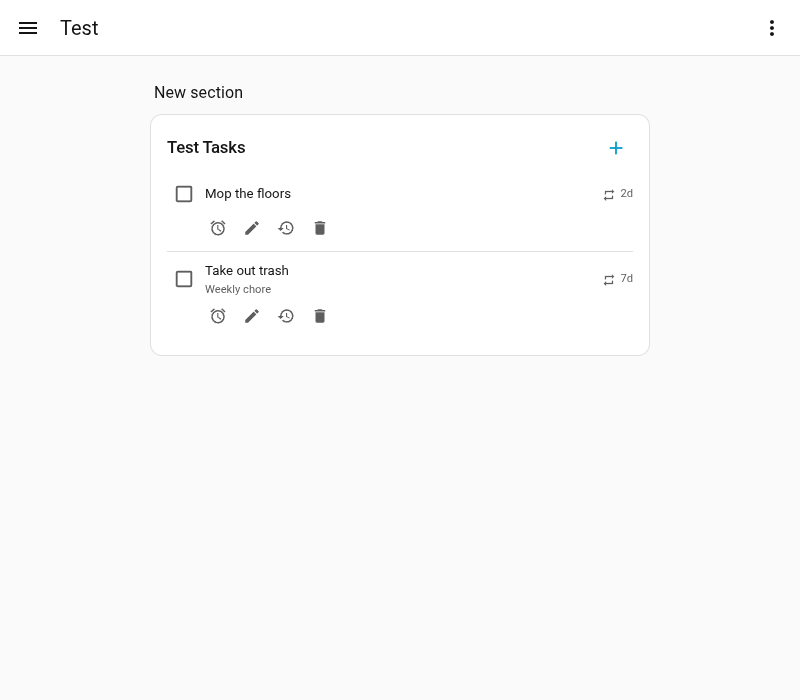
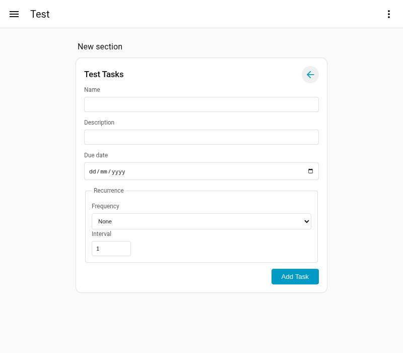
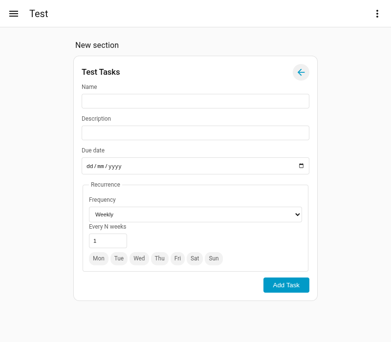
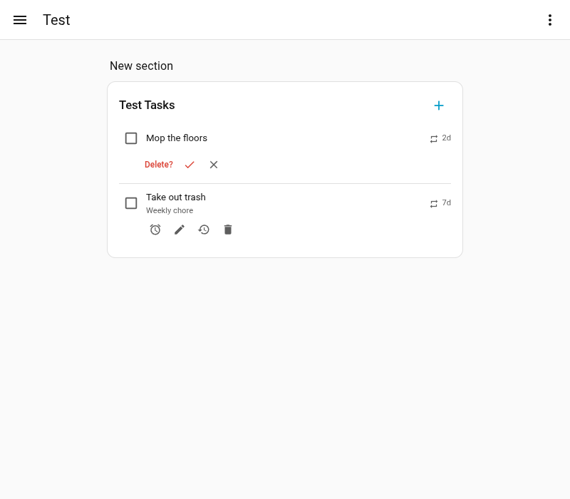
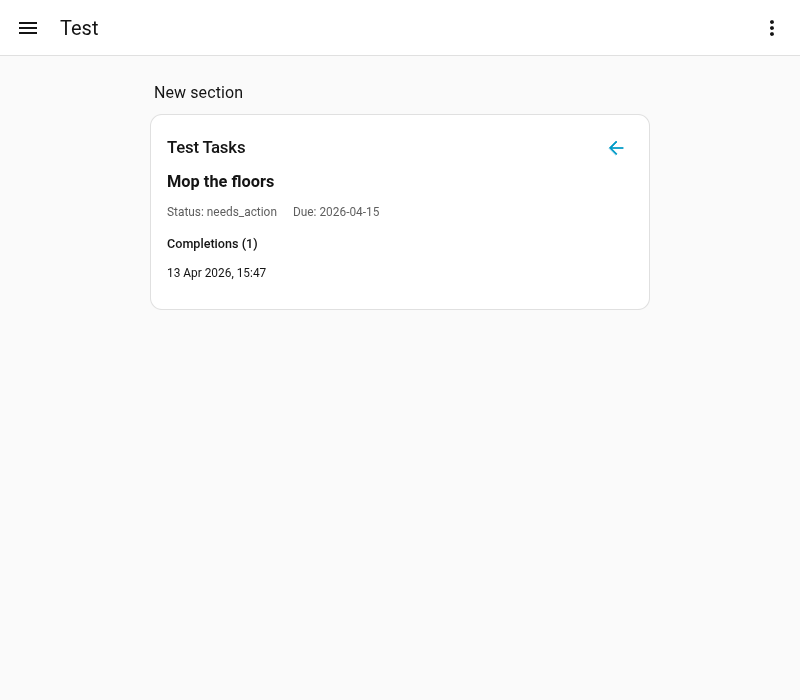

# Recurring Todos for Home Assistant

A custom Home Assistant integration for tracking recurring and one-off tasks/chores. Built on HA's native Todo platform with iCal RRULE recurrence, mobile push notifications, and a custom Lovelace card.

## Features

- **Recurring tasks** with full iCal RRULE support (daily, weekly, monthly, yearly, custom patterns)
- **One-off tasks** that work like standard todo items
- **Completion history** -- every completion recorded, never pruned
- **Overdue detection** -- fires `recurring_todos_overdue` events for automations, exposes `overdue_count` as entity attribute
- **Push notifications** -- configurable lead time and reminder intervals to mobile devices
- **Custom Lovelace card** -- task list with recurrence picker, completion history viewer
- **Multiple task lists** -- each config entry creates a separate list
- **HACS compatible**

## Requirements

- Home Assistant 2026.1.0 or newer

## Installation

### HACS (recommended)

1. Open HACS in your Home Assistant instance
2. Click the three dots menu in the top right and select **Custom repositories**
3. Add this repository URL and select **Integration** as the category
4. Click **Download** on the Recurring Todos card
5. Restart Home Assistant

### Manual

1. Copy the `custom_components/recurring_todos/` directory into your Home Assistant `config/custom_components/` directory
2. Restart Home Assistant

## Setup

1. Go to **Settings > Devices & Services > Add Integration**
2. Search for **Recurring Todos**
3. Enter a name for your task list (e.g., "Household Chores")
4. The integration creates a todo entity (`todo.household_chores`) that works with the built-in HA todo UI

### Lovelace card

The integration automatically registers its custom card. Add it to any dashboard:

- **UI mode**: Edit dashboard → Add Card → search "Recurring Todos" → select your entity
- **YAML mode**:

```yaml
type: custom:recurring-todos-card
entity: todo.household_chores
```

### Card screenshots

| Task list | Add/edit form | Recurrence picker |
|:---------:|:-------------:|:-----------------:|
|  |  |  |

| Delete confirmation | Completion history |
|:-------------------:|:------------------:|
|  |  |

## Configuration

Use the options flow (**Settings > Devices & Services > Recurring Todos > Configure**) to set:

| Option | Default | Description |
|--------|---------|-------------|
| Default recurrence | *(empty)* | RRULE template for new tasks (e.g., `FREQ=WEEKLY`) |
| Notification lead time | 24 hours | How far before the due date to start notifying |
| Overdue reminder interval | 12 hours | How often to re-notify for overdue tasks |
| Notification devices | *(none)* | Mobile app services to send push notifications to |

## Usage

### Adding tasks

Tasks can be added in three ways:

- **HA Todo panel** -- go to the Todo sidebar, select your list, and add items directly
- **Lovelace card** -- use the custom card's add form, which includes a recurrence picker
- **Service call** -- use the built-in `todo.add_item` service:

```yaml
action: todo.add_item
target:
  entity_id: todo.household_chores
data:
  item: "Clean the kitchen"
  due_date: "2026-04-15"
```

### Making tasks recurring

Recurrence is set via the custom Lovelace card's add/edit form. Pick a frequency (daily, weekly, monthly, yearly), interval, and optionally specific days of the week. The card generates a standard iCal RRULE string (e.g., `FREQ=WEEKLY;BYDAY=MO,WE,FR`).

When you complete a recurring task, it automatically resets with the next due date calculated from the rule. One-off tasks (no recurrence) stay completed.

### Multiple task lists

Each integration entry is a separate list. To create additional lists:

1. Go to **Settings > Devices & Services**
2. Click **Add Integration** and search for **Recurring Todos** again
3. Enter a different name (e.g., "Work Tasks")

Each list gets its own entity (e.g., `todo.work_tasks`), its own notification settings, and its own Lovelace card instance.

### Snoozing tasks

Push a task's due date forward when you can't get to it today:

- **Lovelace card** -- use the snooze button on any task
- **Service call**:

```yaml
action: recurring_todos.snooze_task
data:
  entity_id: todo.household_chores
  task_uid: "your-task-uid-here"
  days: 3
```

### Notifications

To receive push notifications for upcoming and overdue tasks:

1. Go to **Settings > Devices & Services > Recurring Todos > Configure**
2. Select your mobile device(s) under **Notification devices**
3. Set **Notification lead time** (how many hours before the due date to start notifying)
4. Set **Overdue reminder interval** (how often to re-notify for overdue tasks)

The integration checks every 30 minutes and sends notifications to selected devices. Each task is only notified once per interval to prevent spam.

## Services

### `recurring_todos.complete_task`

Marks a task as completed. For recurring tasks, records the completion in history, calculates the next due date from the RRULE, and resets the task to needs_action. One-off tasks stay completed.

| Field | Required | Description |
|-------|----------|-------------|
| `entity_id` | Yes | The todo list entity (e.g., `todo.household_chores`) |
| `task_uid` | Yes | The unique identifier of the task |

### `recurring_todos.snooze_task`

Pushes a task's due date forward by a number of days.

| Field | Required | Default | Description |
|-------|----------|---------|-------------|
| `entity_id` | Yes | | The todo list entity |
| `task_uid` | Yes | | The unique identifier of the task |
| `days` | No | 1 | Number of days to snooze (1-365) |

### `recurring_todos.create_task`

Creates a new task with optional recurrence.

| Field | Required | Description |
|-------|----------|-------------|
| `entity_id` | Yes | The todo list entity |
| `name` | Yes | Task name |
| `description` | No | Task description |
| `due_date` | No | Due date in ISO format (e.g., `2026-04-15`) |
| `rrule` | No | iCal RRULE string (e.g., `FREQ=WEEKLY;BYDAY=MO,FR`) |

### `recurring_todos.update_task`

Updates an existing task's fields.

| Field | Required | Description |
|-------|----------|-------------|
| `entity_id` | Yes | The todo list entity |
| `task_uid` | Yes | The unique identifier of the task |
| `name` | No | New task name |
| `description` | No | New description |
| `due_date` | No | New due date in ISO format |
| `rrule` | No | New RRULE string (empty string to remove recurrence) |

## Automation examples

### Notify when tasks become overdue

```yaml
automation:
  - alias: "Notify overdue tasks"
    triggers:
      - trigger: event
        event_type: recurring_todos_overdue
    actions:
      - action: notify.mobile_app_phone
        data:
          title: "Overdue tasks"
          message: "{{ trigger.event.data.overdue_count }} task(s) overdue"
```

### Complete a task from a button

```yaml
automation:
  - alias: "Mark laundry done"
    triggers:
      - trigger: state
        entity_id: input_button.laundry_done
    actions:
      - action: recurring_todos.complete_task
        data:
          entity_id: todo.household_chores
          task_uid: "your-task-uid-here"
```

## Development

```bash
git clone <repo-url>
cd hass-notify

# Run tests (requires venv)
python -m venv .venv
source .venv/bin/activate
pip install -e ".[test]"
pytest tests/

# Local HA instance via Docker
mkdir -p dev-config
cat > dev-config/configuration.yaml <<'YAML'
default_config:

logger:
  default: info
  logs:
    custom_components.recurring_todos: debug
YAML
docker compose up -d
# HA available at http://localhost:8123
```

See also:
- `CLAUDE.md` -- project layout, conventions, quick-start
- `docs/architecture.md` -- module responsibilities, data flow, design decisions
- `docs/api-reference.md` -- services, attributes, events, storage schema, RRULE examples

## License

MIT
